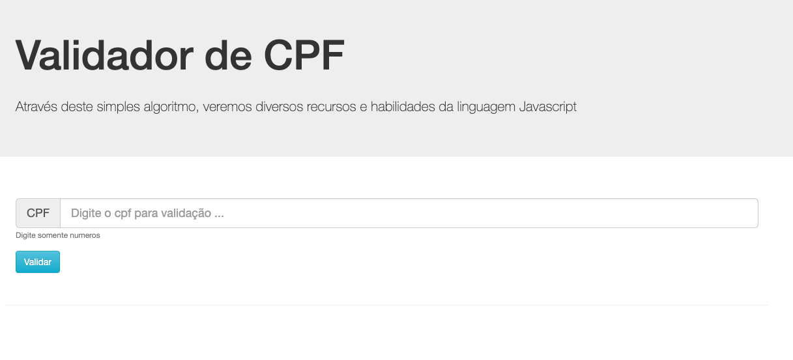

# **💳  Validação de CPF** 

Este projeto tem como intuito utilizar o Javascript para realizar a validação do CPF, o desafio foi proposto no **Bootcamp Hiring Coders** realizado pela **Gama Academy**em parceria com a **VTEX**.</p>

É comum nos depararmos com  a necessidade de validar CPF. 
O que muita gente não sabe que um CPF para ser válido não basta apenas atender à máscara "###.###.###-##" (o caractere '#' representa um número). 
Existe uma regra matemática que também deve ser verificada para um CPF ser considerado válido. 




## Regras para a validação:

#### *Vamos usar como exemplo, um CPF fictício "529.982.247-25".*

 
### Validação do primeiro dígito:

1. Validação do primeiro dígito: multiplique os 9 primeiros dígitos pela sequência decrescente de números de 10 à 2 e soma os resultados. 

``` 
5* 10 + 2 * 9 + 9 * 8 + 9 * 7 + 8 * 6 + 2 * 5 + 2 * 4 + 4 * 3 + 7 * 2 
// 295
```
2. O próximo passo da verificação é simples, basta multiplicar o resultado por 10 e dividir por 11.

``` 
295 * 10 / 11
// 268 , o resto é 2
```

3. Usaremos o RESTO da divisão. Se ele for igual ao primeiro dígito verificador, a primeira parte da validação está correta.

 **Observação Importante:** Se o resto da divisão for igual a 10, nós o consideramos como 0.
 

### Validação do segundo dígito:

1. Validação do segundo dígito: multiplique os 10 primeiros dígitos pela sequência decrescente de números de 11 à 2 e soma os resultados. 

``` 
5 * 11 + 2 * 10 + 9 * 9 + 9 * 8 + 8 * 7 + 2 * 6 + 2 * 5 + 4 * 4 + 7 * 3 + 2 * 2
// 347
```
2. O próximo passo da verificação é simples, basta multiplicar o resultado por 10 e dividir por 11.

``` 
347 * 10 / 11
// 315 , o resto é 5
```
3. Usaremos o RESTO da divisão. Se ele for igual ao segundo dígito verificador, a segunda parte da validação está correta.
 
### Observação Importante

Existem alguns casos de CPFs que passam nessa validação que expliquei, mas que ainda são inválidos. É o caso dos CPFs com dígitos repetidos (111.111.111-11, 222.222.222-22, ...)

#### Por isso é necessário verificar se todos os dígitos do CPF são iguais e, caso sejam todos iguais, serão considerados inválidos.
 
 
#### O conteúdo acima foi retirado e simplificado da página <a href="https://dicasdeprogramacao.com.br/algoritmo-para-validar-cpf/#:~:text=Regra%20para%20validar%20CPF&text=O%20CPF%20%C3%A9%20formado%20por,do%20sinal%20%22%2D%22)" target="_blank">Dicas de programação </a> e pode ser acessado na integra.
